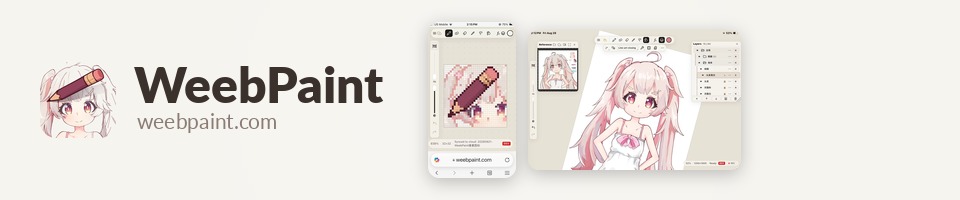
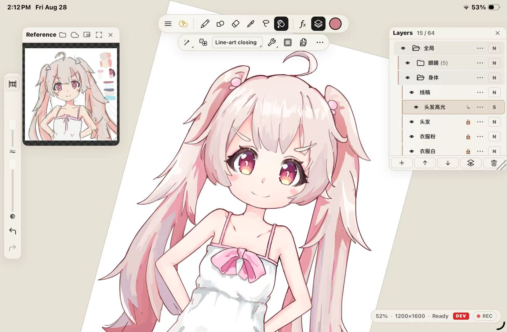
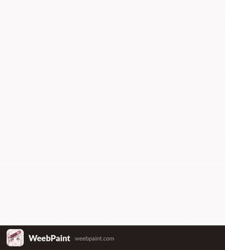

<!-- rewritten by Claude Fable 5 · 2026-08-28 -->

# WeebPaint

WeebPaint is an open-source painting and illustration app that runs in the browser — on iPad, Android tablets, and desktops. Brush feel and fill tools are tuned on anime workflows; pixel art, hand-painted textures, and light image editing use the same toolset. No account, no installation, no server — and a cloud-synced gallery you control.

- **Use it:** https://weebpaint.com/
- **Single-file version:** one .html file that runs from a double-click — [GitHub Releases](https://github.com/fangzhangmnm/weebpaint/releases) or [itch.io](https://fangzhangmnm.itch.io/weebpaint).
- **Videos:** [YouTube @weebpaint-channel](https://www.youtube.com/@weebpaint-channel)

> as-of v0.11.44 · 2026-08-28

## Features

Painting

- Pressure-sensitive brushes with stroke smoothing / stabilization; pen tablet, Apple Pencil, mouse, and touch input.
- Custom brushes; brush libraries can be imported and exported.
- Shape brushes; stamp workflow (transform a shape and stamp it repeatedly).
- Pixel brushes (integer-aligned, no anti-aliasing) and nearest-neighbor / RotSprite transforms.
- Liquify (push, pinch, bloat, twirl, restore).
- Color adjustments (hue / saturation and others).
- Time-lapse recording with mp4 export.

Layers

- Layer groups (nestable), clipping masks, layer masks, blend modes, opacity, merge.
- Reference layer: fill and magic wand read line art from one layer while you paint on another.
- Reference window to keep a source image on screen.

Selection and fill

- Freehand / rectangle / polygon lasso; magic wand; select all / invert / deselect.
- Transform: free, uniform, and perspective; arrow-key pixel nudge.
- Fill with line-art gap closing; fills extend under the line to avoid white edges.

Files

- Projects are standard OpenRaster .ora files: rename to .zip and every layer is a PNG inside. GIMP and Krita open them.
- psd and png export; clipboard copy / paste to and from other apps.
- Local gallery with thumbnails, rename, save-as, image import.
- Per-artwork password protection: an encrypted artwork is stored as ciphertext both locally and in the cloud; the password is never stored or uploaded, and a forgotten password cannot be recovered.

Platform

- Installable PWA, fully offline once installed.
- UI languages: English, 日本語, 中文, toki pona.
- OneDrive sync — see status below. Cloud changes are pulled automatically; local changes upload when you save or leave the artwork. The app can only access its own `Apps/WeebPaint/` folder, nothing else in the drive. Concurrent edits on two devices are never blindly overwritten: a panel asks which side to keep, and the replaced version is kept as a backup. Details: [docs/cloud-sync.md](docs/cloud-sync.md).

## Cloud sync status (2026-08-28)

WeebPaint supports OneDrive sync, and existing authorizations work. What is broken right now is onboarding: OneDrive has a supplier-side fault that blocks new sign-ins from getting drive access.

Since late August 2026, a newly granted `Files.ReadWrite.AppFolder` authorization gets 403 `serviceReadOnly` on every OneDrive request, while grants made months ago keep working — verified with the same code and account minutes apart. The app-folder consent path appears to skip a one-time provisioning step on Microsoft's side. We reported it in [Microsoft Q&A 5983388](https://learn.microsoft.com/en-us/answers/questions/5983388/personal-onedrive-newly-consented-apps-get-403-acc); two independent reproductions so far, no Microsoft response yet. See also [Q&A 5982450](https://learn.microsoft.com/en-us/answers/questions/5982450/onedrive-account-returning-accessdenied-servicerea) (a Microsoft moderator attributes the 403s to a Graph service-side problem) and [rclone#9794](https://github.com/rclone/rclone/issues/9794).

A workaround is known — granting the app full-drive access once provisions the folder permanently — but this app will not ask users for full-drive permission; app-folder-only access is deliberate and permanent. Until Microsoft fixes provisioning, use WeebPaint without signing in: everything else works, files stay on the device, and .ora export works as backup. This section will be updated when the situation changes. Details: [docs/cloud-sync.md](docs/cloud-sync.md).

## Shortcuts and gestures

Shortcuts follow Procreate / Photoshop / Blender where possible. The authoritative list is in-app: menu → "Shortcuts", updated automatically each release. A generated copy: [docs/shortcuts.md](docs/shortcuts.md).

Basics: `B` brush, `E` eraser, two-finger tap undo, three-finger tap redo, pinch to zoom / rotate, `Ctrl+S` save (also pushes to the cloud when signed in).

## Install as an app (PWA)

Open https://weebpaint.com/ in the browser, then:

- **iPad / iPhone (Safari):** Share → "Add to Home Screen".
- **Windows / Mac (Chrome / Edge):** install icon in the address bar, or menu → "Install WeebPaint".
- **Mac (Safari 17+):** File → "Add to Dock".

## FAQ

- **No pen pressure on Windows:** enable **Windows Ink** in your tablet driver (Huion / XP-Pen / Wacom panel), then fully restart the browser — browsers only receive pen pressure through Windows Ink. This doesn't conflict with Clip Studio or Photoshop: they can keep using WinTab.

## Roadmap

Planned, in no particular order:

- Blender link: edit a texture in WeebPaint, push it into Blender's memory over local WebRTC.
- Optional AI tools (line-art cleanup, upscaling) with a user-supplied API key, stored locally.
- Painting directly on 3D models.
- Smudge / color-mixing brushes; textured brushes.
- Seamless-tile preview for texture work.
- Storage providers and mirrors usable in mainland China.

## Self-hosting

The site is fully static; a fork can be built and hosted anywhere. Build and deployment: [docs/self-hosting.md](docs/self-hosting.md). OneDrive sync on your own deployment (your own Azure client id): [docs/onedrive-client-id.md](docs/onedrive-client-id.md).

## Technical notes

- Rendering uses WebGL2. Every mainstream browser since about 2021 has it (on iPhone / iPad: iOS 15 or later); there is nothing to install. Unsupported browsers get an error message.
- The `/dev/` path on weebpaint.com serves the development branch. It is a working area — sometimes deliberately broken mid-change — and it shares local data and the OneDrive folder with the release channel. It is not a nightly channel.

## License

MIT. Commercial use and closed-source forks are permitted. Most of the code was written with Claude Code.
